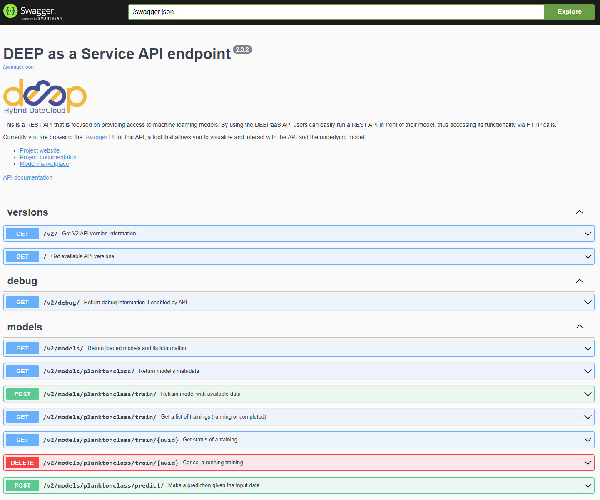

2. API Usage
============

Overview
--------

This page shows the API-based workflow as a sequence of practical steps.

Use this path when you want to work through the DEEPaaS browser UI or call the API endpoints directly.

API workflow
------------

The common order is:

1. install the package
2. create a project
3. validate the config
4. optionally download the pretrained model
5. optionally build an inference Docker image
6. start the API
7. use the training endpoint or prediction endpoint
8. inspect the outputs written by the package

Step 1: Install the package
---------------------------

.. code-block:: bash

   pip install planktonclass

Step 2: Create a project
------------------------

.. code-block:: bash

   planktonclass init my_project

This creates a local ``config.yaml`` and the standard project folders.

Step 3: Validate the config
---------------------------

.. code-block:: bash

   planktonclass validate-config my_project

Step 4: Optional pretrained model
---------------------------------

If you want to start from a published pretrained model:

.. code-block:: bash

   planktonclass pretrained my_project --model FlowCam

Available published pretrained names currently include ``FlowCam``, ``FlowCyto``, and ``PI10``.

Step 5: Optional inference Docker image
---------------------------------------

After training a model, you can package it into a Docker image for a more stable inference runtime:

.. code-block:: bash

   planktonclass docker my_project

Then run the API from Docker:

.. code-block:: bash

   docker run -p 5001:5000 planktonclass-inference:<timestamp>

Inside the container, the API listens on port ``5000``. You can map any free host port.

Step 6: Start the API
---------------------

The DEEPaaS entry point is defined in ``pyproject.toml``:

.. code-block:: text

   [project.entry-points."deepaas.v2.model"]
   planktonclass = "planktonclass.api"

The simplest way to start the API is:

.. code-block:: bash

   planktonclass api my_project

This will start the API:

Then open:

* ``http://127.0.0.1:5000/ui``
* ``http://127.0.0.1:5000/api#/``

Use ``127.0.0.1`` in the browser. ``0.0.0.0`` is only the bind address.

After a repository install, you can also start the API directly:

.. code-block:: powershell

   $env:planktonclass_CONFIG = (Resolve-Path .\my_project\config.yaml)
   $env:DEEPAAS_V2_MODEL = "planktonclass"
   deepaas-run --listen-ip 0.0.0.0

Step 7: Train through the API
-----------------------------

Typical browser flow:

1. start ``planktonclass api my_project``
2. open ``/ui`` or ``/api#/``
3. find the ``TRAIN`` operation
4. edit the parameters you want
5. execute the request

The most important training parameters are:

* ``images_directory``
* ``modelname``
* ``use_pretrained``
* ``pretrained_name``
* ``pretrained_version``
* ``image_size``
* ``batch_size``
* ``epochs``
* ``use_validation``
* ``use_test``
Important limitation:

* ``images_directory`` is a path field, not a browser folder picker
* the API cannot open a server-side folder chooser through Swagger UI
* for local use, it is usually better to set the path in ``config.yaml`` before starting the API
* with the standard project layout from ``planktonclass init``, ``planktonclass api my_project`` automatically uses ``my_project/config.yaml``

Step 8: Run prediction through the API
--------------------------------------

The prediction endpoint accepts:

* ``image``: a single uploaded image
* ``zip``: a ZIP archive containing one or more images

Typical browser flow:

1. start the API
2. open ``/ui`` or ``/api#/``
3. find the ``PREDICT`` ``POST`` method
4. click ``Try it out``
5. provide either ``image`` or ``zip``
6. click ``Execute``

Prediction response
-------------------

The response contains:

* ``filenames``
* ``pred_lab``
* ``pred_prob``
* ``aphia_ids`` when available

What the API exposes
--------------------

The main public API functions are:

* ``get_metadata()``
* ``get_train_args()``
* ``train(**args)``
* ``get_predict_args()``
* ``predict(**args)``

Runtime behavior
----------------

* prediction writes a JSON artifact to the configured predictions directory
* ZIP prediction extracts the archive to a temporary directory and scans recursively for images
* training validates ``images_directory`` before starting
* if there are no models yet, the API can still be used for training, but not for inference
